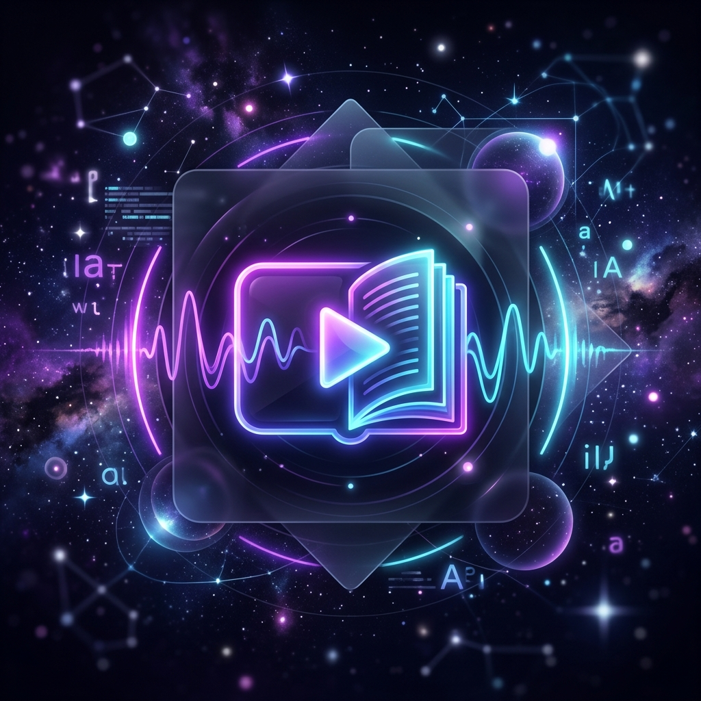
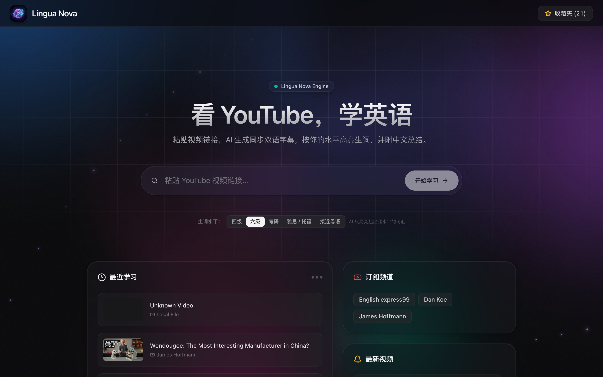
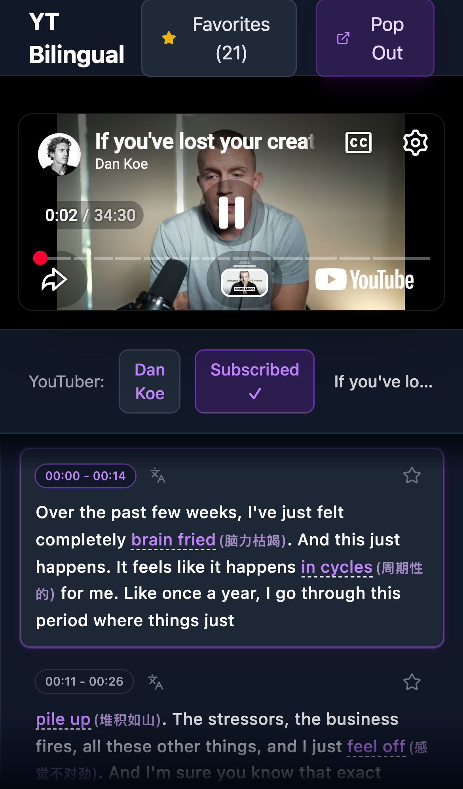

<div align="center">
  
  <h1>Lingua Nova (YT Bilingual)</h1>

  <p align="center">
    <strong>Immersive Language Learning Through Cinematic YouTube Experiences.</strong>
    <br />
    A modern, AI-powered bilingual player that transforms any YouTube video or local show into an interactive language classroom.
  </p>

  <p align="center">
    <a href="https://github.com/huthvincent/yt-bilingual-app/stargazers"></a>
    <a href="https://github.com/huthvincent/yt-bilingual-app/blob/main/LICENSE"></a>
    
    
    
  </p>
</div>

<br />

> **Experience language learning natively.**  
> Built with an Apple-inspired Glassmorphic UI and Framer Motion for a fluid, premium experience.

## ✨ Why Lingua Nova?

Traditional language learning apps can feel clinical and repetitive. **Lingua Nova** leverages the content you already love—YouTube videos and your favorite TV shows—and enriches it with the power of LLMs (Google Gemini). 

By offering **synchronized bilingual subtitles**, **context-aware vocabulary highlights**, and an **edge-to-edge cinematic player**, you immerse yourself entirely. It’s less like studying and more like enjoying content, with all the friction of translation and lookup completely removed.

<br />

<div align="center">
  
  <p><em>The all-new Bento-style Dashboard with dynamic glass panels.</em></p>
</div>

<br />

## 🌟 Core Features

- **🎬 Cinematic Player**: Edge-to-edge video with synchronized, auto-scrolling bilingual transcripts.
- **✨ Intelligent Vocabulary Extraction**: Gemini AI parses the transcript, highlights idioms and advanced vocabulary, and automatically appends inline Chinese translations (e.g. `(中文释义)`).
- **🕹️ Click-to-Seek Navigation**: Reading ahead? Click any sentence in the transcript to instantly jump to that timestamp in the video.
- **📚 Personal Vocabulary Vault (Favorites)**: Star important sentences while watching. They are saved to your Favorites Dashboard alongside the exact video context and time.
- **📺 Local Show Support**: Import your own `.srt` files and binge TV shows (like *House of Cards*) bilingually.
- **🔔 Channel Subscriptions**: Follow your favorite YouTubers right from the dashboard and get a feed of their latest videos.
- **📱 Native Mobile Experience**: Seamlessly switch to the Expo React Native app to learn on the go.

<br />

<div align="center">
  
  <p><em>Immersive transcript view with vocabulary highlights and click-to-seek functionality.</em></p>
</div>

<br />

## 🛠️ Tech Stack & Architecture

We prioritize speed, fluidity, and developer experience.

| Layer | Technologies | Description |
|---|---|---|
| **Frontend** | React, TypeScript, Vite | Blazing fast SPA with hot-module reloading. |
| **Styling** | Tailwind CSS, Framer Motion | Glassmorphic, highly animated, premium UI. |
| **Backend** | Python, FastAPI | High-performance async API processing subtitles. |
| **AI / NLP** | Google Gemini 2.5 Flash | Cost-effective, high-speed LLM for translation. |
| **Mobile** | React Native, Expo | Cross-platform mobile client for iOS and Android. |

<br />

## 🚀 Getting Started

Experience the app locally in just a few minutes.

### Prerequisites

- **Node.js** (v18+)
- **Python** (3.10+)
- **Google Gemini API Key**: Get it for free at [Google AI Studio](https://aistudio.google.com/apikey).

### 1. Clone & Install
```bash
git clone https://github.com/huthvincent/yt-bilingual-app.git
cd yt-bilingual-app

# Run the automated setup script
chmod +x setup.sh
./setup.sh
```

### 2. Configure Environment
```bash
cp .env.example .env
```
Open `.env` and paste your Gemini API Key:
```env
GEMINI_API_KEY="your_api_key_here"
```

### 3. Launch the Application
For macOS users, simply run the command file:
```bash
./start_app.command
```
*(Alternatively, run the backend `uvicorn main:app --port 8000` and frontend `npm run dev` manually in separate terminals.)*

Open **http://localhost:5173** and paste any YouTube link!

<br />

<div align="center">
  
  <p><em>A companion Mobile App is included in the repo for learning on the go.</em></p>
</div>

<br />

## 🗺️ Roadmap

- [x] Full UI overhaul (Glassmorphism & Framer Motion)
- [x] Context-aware vocabulary highlighting
- [x] Channel subscription dashboard
- [x] Synced mobile companion app
- [ ] **AI Pronunciation Assessment**: Practice speaking the sentences and get instant feedback.
- [ ] **Spaced Repetition System (SRS)**: Export favorites directly to Anki or review them in-app.
- [ ] **Chrome Extension**: Intercept YouTube videos directly from the browser.

## 🤝 Contributing

We welcome contributions! Whether it's submitting a bug report, requesting a feature, or writing code.

1. Fork the Project
2. Create your Feature Branch (`git checkout -b feature/AmazingFeature`)
3. Commit your Changes (`git commit -m 'Add some AmazingFeature'`)
4. Push to the Branch (`git push origin feature/AmazingFeature`)
5. Open a Pull Request

## 📄 License

Distributed under the MIT License. See `LICENSE` for more information.

---
<div align="center">
  <i>Crafted with ❤️ for language learners around the world.</i>
</div>
