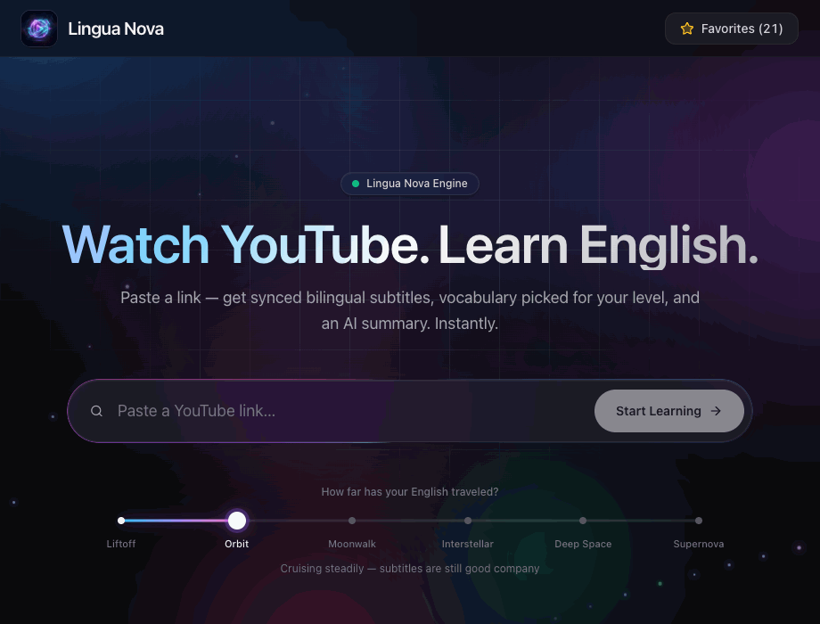
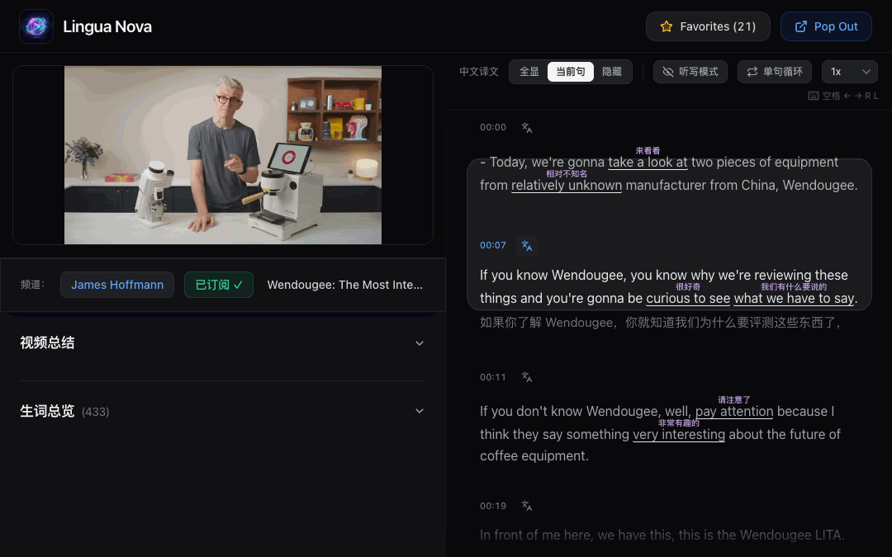
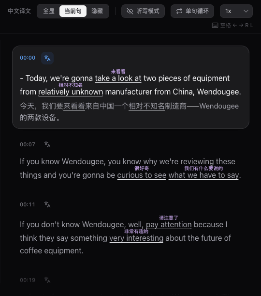
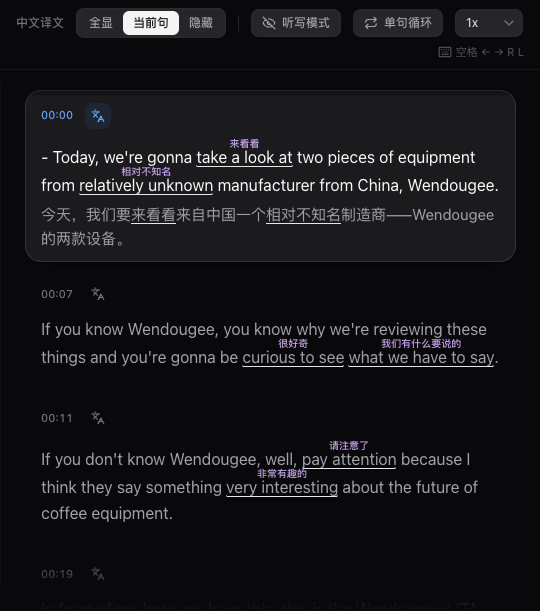
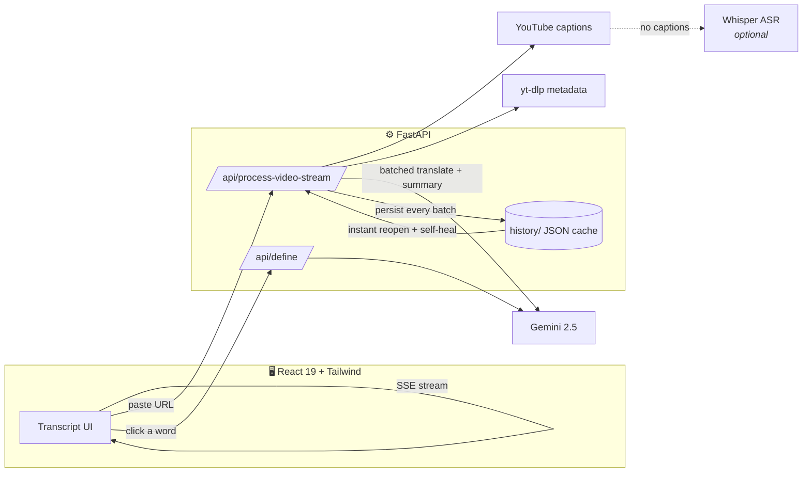
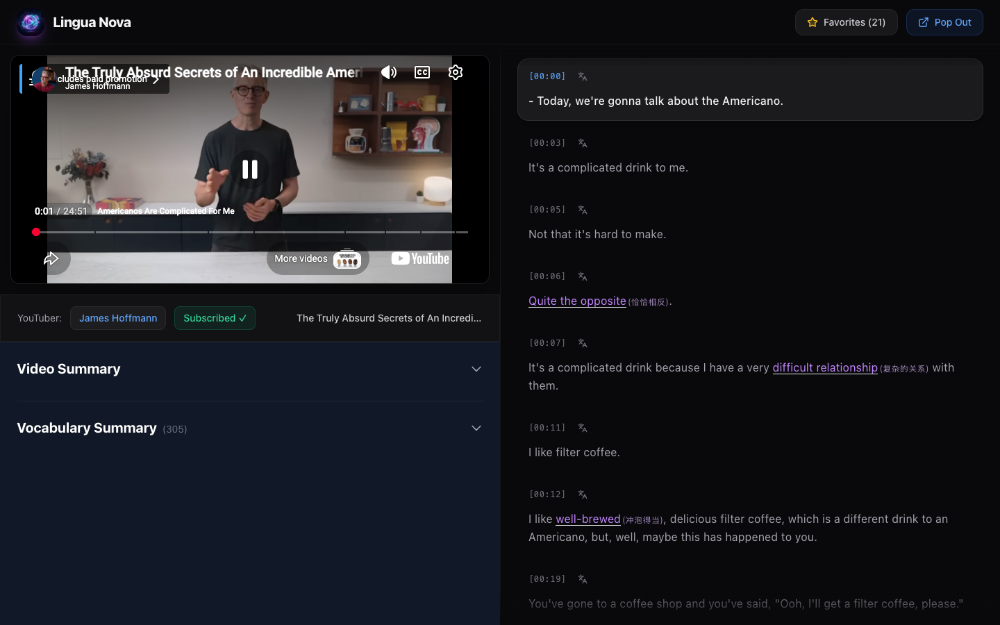

<div align="center">


# Lingua Nova

### Turn any YouTube video into an immersive English lesson.

AI bilingual subtitles that stream in live · click any word for an instant dictionary · listening drills built in.<br/>
Designed for Chinese learners. Built like Apple would.

<br/>

[](https://github.com/huthvincent/yt-bilingual-app/stargazers)
[](LICENSE)


[Quick Start](#-quick-start) · [Features](#the-full-toolkit) · [Architecture](#-architecture) · [中文文档](README_zh.md)

<br/>



</div>

<br/>

## Why Lingua Nova

Most language apps make you study *their* content. Lingua Nova flips that: paste a link to **any YouTube video you actually want to watch**, and it becomes a complete lesson — synchronized bilingual subtitles, vocabulary highlighted *at your level*, a tap-to-define dictionary, and listening drills. The friction of looking things up disappears; only the input remains.

| | | |
|:---:|:---:|:---:|
| **⚡ Instant** | **🎯 Personal** | **🔁 Complete** |
| English subtitles appear the moment they're fetched — translations stream in live while you watch. Stop anytime; it resumes where it left off. | Tell it your level (CET-4 → near-native) and the AI highlights only words *above* it. Reopen any video and continue from your last position. | Watch → look up → collect → drill → export to Anki. The whole learning loop, not just a player. |

<br/>

## See it in action

### A transcript that moves with the video

The active sentence follows playback with a physical spring animation. Click any sentence to jump the video there. AI-picked vocabulary carries its Chinese gloss as ruby text above the word — visible at a glance, ignorable at speed.

<div align="center">

</div>

<br/>

### Click any word. Any word.

One click on any word in the transcript opens a dictionary card: IPA, part of speech, a context-aware Chinese gloss, an English definition, and an example sentence — with one-tap pronunciation and one-tap save to your vocabulary book. Definitions are cached on disk, so each word costs an API call exactly once, ever.

<table align="center">
<tr>
<td align="center" width="50%">
<br/>
<sub><b>Tap-to-define dictionary</b> — IPA · 释义 · TTS · 生词本</sub>
</td>
<td align="center" width="50%">
<br/>
<sub><b>Dictation mode</b> — listen first, reveal to check yourself</sub>
</td>
</tr>
</table>

<br/>

## The full toolkit

| | Feature | What it does |
|---|---|---|
| 🌊 | **Progressive streaming** | English subtitles render instantly; Gemini translations stream in batch-by-batch over SSE with a live progress bar. Cancel anytime — partial work is saved and self-heals on the next open. |
| 📖 | **Tap-to-define dictionary** | IPA, POS, contextual 中文释义, English definition, example — cached forever after the first lookup. |
| 🎚 | **Leveled highlighting** | 四级 / 六级 / 考研 / 雅思·托福 / near-native — the AI highlights only vocabulary above *your* level. |
| 👂 | **Listening drills** | Dictation mode (blur → listen → reveal), single-sentence loop, 0.5–2× speed, full keyboard control. |
| 🈯 | **Translation display modes** | 全显 / 当前句 / 隐藏 — a global policy (persisted across sessions) with on-the-fly per-sentence override. |
| 🧠 | **AI video summary** | A Chinese bullet-point digest of the whole video, generated alongside the subtitles. |
| ⭐ | **Vocabulary book → Anki** | Star sentences and words with their source context and timestamp; export Anki-ready TSV or full CSV. |
| ⏯ | **Resume everywhere** | Per-video position memory, 已学 N% progress on history cards, instant reopen from cache. |
| 📺 | **Channel subscriptions** | Follow creators and start lessons straight from their latest uploads. |
| 🎙 | **No captions? No problem** | Optional local Whisper ASR transcribes caption-less videos (`pip install faster-whisper`). |
| 🖥 | **Pop-out transcript** | A Document-PiP floating subtitle window that lives above any app. |
| 📁 | **Local shows** | Drop `.srt` files in `subtitles/<show>/S01/E01.srt` and binge your own series bilingually. |

### Keyboard shortcuts

| Key | Action | Key | Action |
|---|---|---|---|
| `Space` | Play / pause | `R` | Replay current sentence |
| `←` / `→` | Previous / next sentence | `L` | Loop current sentence |

<br/>

## 🏗 Architecture



**The streaming pipeline is the heart of it.** A video used to mean staring at a spinner for the whole serial translation run. Now: captions are fetched (seconds), English renders immediately, and translation batches stream in while you watch. Every batch is persisted — interrupt anything, and the next open finishes the job automatically.

<br/>

## 🚀 Quick Start

> **Prereqs:** Node 18+, Python 3.10+, and a free [Gemini API key](https://aistudio.google.com/apikey).

```bash
git clone https://github.com/huthvincent/yt-bilingual-app.git
cd yt-bilingual-app

./setup.sh                       # installs frontend + backend deps
cp .env.example .env             # then paste your GEMINI_API_KEY

./start_app.command              # macOS one-click (or run the two commands below)
```

<details>
<summary>Manual start</summary>

```bash
# terminal 1 — backend
cd backend && source venv/bin/activate && uvicorn main:app --port 8000

# terminal 2 — frontend
cd frontend && npm run dev
```
</details>

Open **http://localhost:5173**, paste a YouTube link, pick your vocabulary level, and press 开始学习.

### Configuration

| Variable | Where | Purpose |
|---|---|---|
| `GEMINI_API_KEY` | `.env` | **Required.** Translation, summaries, dictionary. |
| `WHISPER_MODEL` | `.env` | Whisper size for the ASR fallback (`base` default). |
| `CORS_ORIGINS` | `.env` | Comma-separated allowed origins — set before deploying publicly. |
| `API_AUTH_KEY` | `.env` | When set, every API call must send `X-API-Key`. Protects your Gemini quota on public deployments. |
| `VITE_API_BASE` / `VITE_API_KEY` | frontend env | Point the web app at a remote backend / send its API key. |
| `HISTORY_DIR` / `SUBTITLES_DIR` | env | Relocate the JSON cache / local-show subtitles. |

<br/>

## 🎨 Design

The interface follows a codified, Apple-HIG-inspired design language — one accent color, vibrancy materials, a size-tiered radius scale, semibold-capped typography with SF Pro + PingFang SC, tabular numerals, and physical spring motion. The full specification lives in [docs/DESIGN.md](docs/DESIGN.md).

<div align="center">

</div>

<br/>

## 📱 Mobile companion

An Expo React Native client ships in [`mobile/`](mobile) for learning on the go (currently tracks the classic API).

<br/>

## 🗺 Roadmap

- [x] Progressive SSE pipeline with resume & self-healing translations
- [x] Tap-to-define dictionary with IPA, TTS, and vocabulary book
- [x] Dictation mode, sentence loop, playback speed, keyboard control
- [x] Leveled vocabulary highlighting (CET-4 → near-native)
- [x] Anki / CSV export
- [x] Whisper ASR fallback for caption-less videos
- [ ] AI pronunciation assessment (speak the sentence, get scored)
- [ ] In-app spaced-repetition review
- [ ] Chrome extension — start a lesson from any YouTube page
- [ ] Mobile parity with the streaming pipeline

<br/>

## 🤝 Contributing

Issues and PRs welcome. Fork → `git checkout -b feature/amazing` → commit → PR. Please keep UI changes consistent with [docs/DESIGN.md](docs/DESIGN.md).

## 📄 License

MIT — see [LICENSE](LICENSE).

---

<div align="center">
<sub>Crafted with ❤️ for language learners. README media is reproducible: <code>cd scripts && APP_URL=http://localhost:5173 node capture.mjs all</code>.</sub>
</div>
