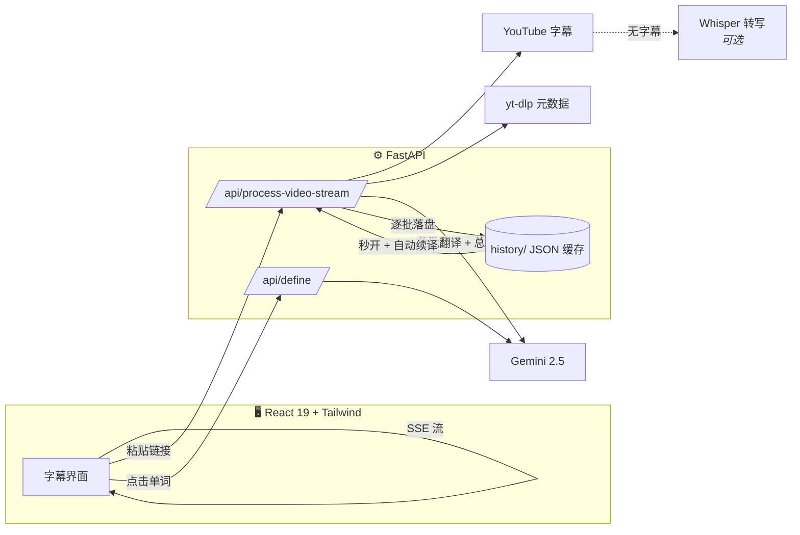

<div align="center">


# Lingua Nova

### 把任何 YouTube 视频，变成一堂沉浸式英语课。

AI 双语字幕实时流式生成 · 点击任意单词即查词典 · 内置精听训练<br/>
为中文学习者设计，以苹果的设计标准打磨。

<br/>

[](https://github.com/huthvincent/yt-bilingual-app/stargazers)
[](LICENSE)


[快速开始](#-快速开始) · [功能全览](#功能全览) · [架构](#-架构) · [English](README.md)

<br/>


</div>

<br/>

## 为什么是 Lingua Nova

大多数语言应用让你学*它们*准备的内容。Lingua Nova 反过来：粘贴一条**你真正想看的 YouTube 视频**链接，它就变成一堂完整的课——同步双语字幕、按你的水平高亮生词、点击即查的词典、随手可用的精听训练。查词与翻译的摩擦被彻底消除，剩下的只有输入。

| | | |
|:---:|:---:|:---:|
| **⚡ 即时** | **🎯 个性化** | **🔁 完整闭环** |
| 英文字幕秒出，翻译边看边流式填充；随时中断，下次打开自动续译。 | 设定你的词汇水平（四级 → 接近母语），AI 只高亮超出水平的词；每个视频自动续播。 | 看 → 查 → 收藏 → 精听 → 导出 Anki。完整的学习闭环，不只是个播放器。 |

<br/>

## 实际效果

### 跟着视频走的字幕

当前句以物理弹簧动画跟随播放进度；点击任意句子，视频立刻跳转。AI 选出的生词以 ruby 注音形式把中文释义放在单词上方——想看一眼就懂，不想看也不挡路。

<div align="center">

</div>

<br/>

### 点击任何一个单词

字幕里的每个单词都可以点：音标、词性、贴合语境的中文释义、英文释义、例句，外加一键发音和一键加入生词本。释义在本地缓存——每个词的 API 成本一生只花一次。

<table align="center">
<tr>
<td align="center" width="50%">
<br/>
<sub><b>点查词典</b> — 音标 · 释义 · 发音 · 生词本</sub>
</td>
<td align="center" width="50%">
<br/>
<sub><b>听写模式</b> — 先听后看，点击核对</sub>
</td>
</tr>
</table>

<br/>

## 功能全览

| | 功能 | 说明 |
|---|---|---|
| 🌊 | **流式渐进加载** | 英文字幕即时渲染，Gemini 翻译按批次经 SSE 流式推送并显示进度；可随时取消，已完成部分自动保存并在下次打开时续译。 |
| 📖 | **点查词典** | 音标、词性、语境中文释义、英文释义、例句——首查后永久缓存。 |
| 🎚 | **按水平高亮** | 四级 / 六级 / 考研 / 雅思·托福 / 接近母语——AI 只标注超出你水平的词汇。 |
| 👂 | **精听训练** | 听写模式（模糊 → 听 → 揭示）、单句循环、0.5–2× 倍速、全键盘操作。 |
| 🈯 | **译文显示策略** | 全显 / 当前句 / 隐藏——全局策略跨会话记忆，另可逐句临时覆盖。 |
| 🧠 | **AI 视频总结** | 随字幕一并生成的中文要点摘要。 |
| ⭐ | **生词本 → Anki** | 收藏句子和单词（带原句与时间戳），一键导出 Anki TSV 或完整 CSV。 |
| ⏯ | **处处可续** | 每个视频记忆播放位置，历史卡片显示「已学 N%」，缓存视频秒开。 |
| 📺 | **频道订阅** | 关注创作者，从最新视频直接开课。 |
| 🎙 | **没字幕也能学** | 可选的本地 Whisper 转写支持无字幕视频（`pip install faster-whisper`）。 |
| 🖥 | **悬浮字幕窗** | Document-PiP 弹出窗口，悬浮于任何应用之上。 |
| 📁 | **本地剧集** | 把 `.srt` 按 `subtitles/<剧名>/S01/E01.srt` 放置，双语刷自己的剧。 |

### 快捷键

| 按键 | 操作 | 按键 | 操作 |
|---|---|---|---|
| `空格` | 播放 / 暂停 | `R` | 重播本句 |
| `←` / `→` | 上一句 / 下一句 | `L` | 单句循环 |

<br/>

## 🏗 架构



**流式管线是核心。** 过去处理一个视频意味着对着加载圈干等整轮串行翻译；现在字幕几秒拉取完成、英文立即可读、翻译边看边填充。每一批都会落盘——任何中断，下次打开自动补完。

<br/>

## 🚀 快速开始

> **环境要求：** Node 18+、Python 3.10+、一个免费的 [Gemini API key](https://aistudio.google.com/apikey)。

```bash
git clone https://github.com/huthvincent/yt-bilingual-app.git
cd yt-bilingual-app

./setup.sh                       # 安装前后端依赖
cp .env.example .env             # 填入你的 GEMINI_API_KEY

./start_app.command              # macOS 一键启动（或手动起两个服务，见下）
```

<details>
<summary>手动启动</summary>

```bash
# 终端 1 — 后端
cd backend && source venv/bin/activate && uvicorn main:app --port 8000

# 终端 2 — 前端
cd frontend && npm run dev
```
</details>

打开 **http://localhost:5173**，粘贴 YouTube 链接，选好词汇水平，点「开始学习」。

### 配置项

| 变量 | 位置 | 用途 |
|---|---|---|
| `GEMINI_API_KEY` | `.env` | **必填。** 翻译、总结、词典。 |
| `WHISPER_MODEL` | `.env` | ASR 回退使用的 Whisper 模型大小（默认 `base`）。 |
| `CORS_ORIGINS` | `.env` | 允许的跨域来源（逗号分隔）——公网部署前务必设置。 |
| `API_AUTH_KEY` | `.env` | 设置后所有 API 调用必须携带 `X-API-Key`，保护你的 Gemini 配额。 |
| `VITE_API_BASE` / `VITE_API_KEY` | 前端环境 | 让 Web 端指向远程后端 / 发送其 API key。 |
| `HISTORY_DIR` / `SUBTITLES_DIR` | 环境变量 | 自定义 JSON 缓存 / 本地剧集字幕目录。 |

<br/>

## 🎨 设计

界面遵循一套成文的、受 Apple HIG 启发的设计语言——单一强调色、vibrancy 玻璃材质、按尺寸分级的圆角体系、以 semibold 封顶的 SF Pro + 苹方排版、表格数字、物理弹簧动效。完整规范见 [docs/DESIGN.md](docs/DESIGN.md)。

<div align="center">

</div>

<br/>

## 📱 移动端

[`mobile/`](mobile) 内附 Expo React Native 客户端，随时随地学习（目前对接经典版 API）。

<br/>

## 🗺 路线图

- [x] SSE 渐进式管线（断点续译 + 自动修复）
- [x] 点查词典（音标 / 发音 / 生词本）
- [x] 听写模式、单句循环、倍速、键盘操作
- [x] 按水平高亮生词（四级 → 接近母语）
- [x] Anki / CSV 导出
- [x] 无字幕视频的 Whisper 转写回退
- [ ] AI 发音评测（跟读打分）
- [ ] 应用内间隔重复复习
- [ ] Chrome 扩展——在任意 YouTube 页面一键开课
- [ ] 移动端接入流式管线

<br/>

## 🤝 参与贡献

欢迎 Issue 和 PR。Fork → `git checkout -b feature/amazing` → 提交 → PR。界面改动请保持与 [docs/DESIGN.md](docs/DESIGN.md) 一致。

## 📄 许可

MIT — 见 [LICENSE](LICENSE)。

---

<div align="center">
<sub>为语言学习者用 ❤️ 打造。README 媒体可一键复现：<code>cd scripts && APP_URL=http://localhost:5173 node capture.mjs all</code></sub>
</div>
