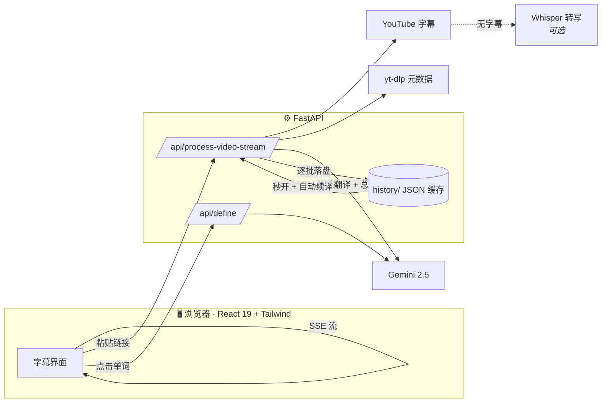

# 系统架构

一句话：**浏览器里的 React 应用** ↔ **FastAPI 后端** ↔ **Gemini / YouTube / 本地缓存**。

---

## 总览



| 层 | 技术 | 职责 |
|---|---|---|
| 前端 | React 19、Vite、Tailwind、Framer Motion | 界面、播放同步、字幕渲染、流式接收 |
| 后端 | Python、FastAPI | 抓字幕、调 AI、分批翻译、缓存、SSE 推送 |
| AI | Gemini 2.5（flash / flash-lite / pro） | 翻译、生词高亮、视频总结、词典释义 |
| 兜底 | faster-whisper（可选） | 无字幕视频的本地语音转写 |

## 核心数据流：流式管线

这是整个产品的心脏，详见 [规格 001](../specs/001-streaming-pipeline/spec.md)：

1. 用户粘贴链接 → 后端用 `youtube-transcript-api` 抓英文字幕（秒级）。
2. 字幕按句切分（`group_transcript_blocks`），**英文立即通过 SSE `meta` 事件推给前端**，用户马上能看能播。
3. 后端按每批 20 句调 Gemini 翻译，**每翻完一批就推一个 `batch` 事件并落盘**。
4. 全部翻完后生成中文总结（`summary` 事件），最后 `done`。
5. 任何时候中断都没关系：已翻的部分已存盘，未翻的标记为 `[未翻译]`，下次打开自动续译（`retranslate_marked_blocks`）。

## 目录结构

```
yt-bilingual-app/
├── frontend/          React + Vite 前端
│   └── src/
│       ├── App.tsx            顶层：状态、播放控制、快捷键、视图切换
│       ├── components/        UI 组件（见下）
│       └── lib/               纯逻辑：api / transcript / settings / progress / exporter / tts / toast
├── backend/
│   └── main.py        全部后端 API（单文件）
├── mobile/            Expo React Native 客户端（对接经典版 API）
├── scripts/           媒体录制（capture.mjs）+ 字幕下载工具
├── subtitles/         本地剧集 SRT（不入库，见 .gitignore）
├── content/sentences/ 句子精背静态内容（5 级 × 100 句，入库）
├── history/           运行时缓存（不入库）：每视频一个 JSON + 收藏/订阅/词典缓存
├── docs/              本套中文文档
├── specs/             各功能的规格与方案
└── .specify/          项目宪法与文档模板
```

## 后端 `main.py` 的职责分区

| 区域 | 关键函数 | 说明 |
|---|---|---|
| 安全 | `require_api_key` 中间件、CORS 配置 | 可选 `X-API-Key`、可配 CORS、历史文件路径穿越防护 |
| 抓字幕 | `fetch_english_transcript` | 把各种失败（无字幕/地区限制/被限流）映射成清晰的中文错误 |
| 切句 | `group_transcript_blocks`、`group_srt_blocks` | 把零碎字幕片段合并成完整句子 |
| 翻译 | `process_llm_batch` | 调 Gemini，**按 id 对齐**合并结果（防错位），按用户水平挑生词 |
| 流式 | `process_video_stream`、`_stream_translate`、`_sse` | SSE 端点与逐批推送 |
| 缓存自愈 | `find_history_file_for_video`、`retranslate_marked_blocks`、`needs_retranslation` | 秒开已处理视频、自动补译失败块 |
| 词典 | `/api/define` | 单词释义，落盘 `dictionary_cache.json`，每词只花一次 |
| 本地剧集 | `parse_srt`、`list_shows`、`process_subtitle` | SRT 解析与处理（复用同一套翻译/缓存） |
| 订阅 | `get_channel_updates`、`_fetch_channel_videos` | 线程池并行抓取 + 15 分钟缓存 |
| 转写兜底 | `_asr_available`、`_transcribe_audio_with_whisper` | 无字幕时本地 Whisper（可选依赖） |
| 句子精背 | `/api/sentences/levels`、`/api/sentences/level/{id}` | 读 `content/sentences/` 提供精选句子（见 [规格 009](../specs/009-sentence-packs/spec.md)） |

## 前端模块

- **`lib/`（纯逻辑，无 UI）**：`api.ts`（带 Key 的 fetch）、`transcript.ts`（活跃句计算、SSE 解析、译文显示模式）、`settings.ts`（生词水平）、`progress.ts`（进度记忆）、`exporter.ts`（Anki/CSV 导出）、`tts.ts`（朗读）、`toast.ts`（轻提示）。
- **`components/`**：`App` 顶层编排；`InputScreen` 首页；`TranscriptView` + `TranscriptBlock` 字幕（已 memo 化，丝滑跟随）；`VideoPlayer` 播放器；`WordPopover` 点查词典；`FavoritesModal` 收藏夹；`ModelSelectionModal` 选模型；`ShowBrowser` 本地剧集；`VocabAxis` 生词水平轴；`AuroraBackground` / `TiltCard` 动效；`Toaster` 提示。

## 数据存储

全部是本机 JSON 文件（`history/` 目录，不入库）：

- `<频道>_<日期>_<videoId>.json` — 每个视频一份：元数据 + 双语字幕 + 总结。
- `<剧名>_S01E01.json` — 每集本地剧集一份。
- `favorites.json` — 收藏（句子 + 生词）。
- `subscriptions.json` — 订阅频道。
- `dictionary_cache.json` — 词典释义缓存。

## 部署

仓库带 `Dockerfile`、`railway.toml`、`Procfile`。公网部署前务必设置 `API_AUTH_KEY` 和 `CORS_ORIGINS`（见 [开发指南](./开发指南.md)）。
